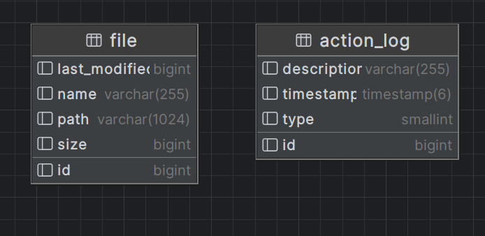

# Technologie obiektowe - Projekt

## Setup

### Wymagania systemowe:

- Zainstalowana **Java 17** (lub wyższa) na Twoim komputerze.
- Zainstalowany **Gradle** w wersji kompatybilnej z projektem.
- Zainstalowany **Docker** do uruchomienia kontenera z bazą danych.

### Kroki do uruchomienia projektu:

**1. Jeżeli chcesz używyć innej bazy niż do developmentu, to zmień wartości w pliku `.env` ze zmiennymi
środowiskowymi, który znajduje się w folderze `resources`**.

**2. Skonfiguruj bazę danych:**

- Uruchom kontener z bazą danych PostgreSQL za pomocą Docker Compose.
- W katalogu głównym projektu uruchom następujące polecenie, aby uruchomić kontener z bazą:
  ```bash
  docker-compose up
  ```

**3. Uruchom aplikację:**

  ```bash
  ./gradlew run
  ```

### Zależności:

- Aplikacja wykorzystuje **JavaFX** do budowy interfejsu graficznego.
- Używamy frameworków **Spring Boot** i **Hibernate** do
  zarządzania bazą danych i do wstrzykiwania zależności.
- Projekt używa biblioteki **PostgreSQL** do komunikacji z bazą danych.
- Do testów używamy **JUnit 5**.
- Korzystamy z Jimfs, aby symulować system plików w testach.

## Milestone 1

### Podział pracy

- **Tomasz Kurcoń** - stworzenie bazy danych, implementacja rekursywnego szukania plików, ulepszenie połączenia Springa
  i JavaFx
- **Filip Bieńkowski** - stworzenie interfejsu graficznego
- **Piotr Karamon** - konfiguracja Springa, połaczenie Springa z JavaFx, stworzenie encji i funkcjonalności wyszukiwania
  największych plików, wielowątkowość w ui
- **Jakub Zawistowski** - usuwanie plików

### Stan projektu

Aplikacja obecenie pozwala na wybranie katalogu, który chcemy by został zbadany.
Po wybraniu katalogu aplikacja zapisuje dane o plikach do bazy, a następnie
wyświetla listę znalezionych plików w postaci tabeli.
Możemy potem wyświetlić 10 największych, lub wyświetlić wszystkie.
Możemy również usunąć zaznaczone przez nas pliki.

## Milestone 2

### Podział pracy

- **Tomasz Kurcoń** - dodanie okien dialogowych pozwalających na wybór ilości największych plików do wyświetlenia,
  wpisywania wyrażeń regularnych do filtrowania plików, ponownego wyboru ścieżki
- **Filip Bieńkowski** - stworzenie ui dla znajdowania duplikatów oraz wyświetlania action logów,
- **Piotr Karamon** - dodanie znajdowania plików "wersji", action logów, aktualizacja dokumentacji
- **Jakub Zawistowski** - dodanie znajdowania duplikatów plików

### Stan projektu

Aplikacja pozwala na wybranie katalogu, który chcemy by został zbadany.
Po wybraniu katalogu aplikacja zapisuje dane o plikach do bazy, a następnie
wyświetlana jest lista znalezionych plików w postaci tabeli.
Za pomocą przycisków na głównym widoku aplikacji można:

- Wyświetlić listę największych plików, po podaniu ilości
- Zaznaczyć pliki, a następnie za pomocą przycisku "Delete" usunąć je
- Wyświetlić tabelę z logami akcji
- Znaleźć duplikaty, czyli pliki które mają ten sam rozmiar oraz hash zawartości.
  Do hashowania używamy algorytmu SHA-256. Po kliknięciu na przycisk "Find duplicates" aplikacja
  wyświetla duplikaty w postaci listy tabel. W każdej osobnej tabeli znajdują się pliki, które są duplikatami.
  Każda tabela posiada trzy przyciski:
    - "Delete All" - usuwa wszystkie pliki z tabeli
    - "Delete Selected" - usuwa zaznaczone pliki
    - "Archive" - zapisuje pliki do archiwum zip
- Znaleźć pliki "wersji", czyli pliki które mają bardzo podobne nazwy, jak np. "text_v1.txt", "text_v2.txt" ...
  Aby określić podobieństwo nazw plików używamy algorytmu Levenshteina.
  Po kliknięciu 'Find versions' otwiera się okno dialogowe, w którym można ustawić maksymalną odległość Levenshteina
  określającą stopień różnicy w nazwach plików.

## Baza danych

Używamy dwóch tabel - jedna przechowywuje informacje o plikach, a druga logi o wykonywanych akcjach.



W aplikacji korzystamy z funkcji Levenshtein.
Musimy więc aktywować rozszerzenie
`fuzzystrmatch`. Robimy to w pliku `schema.sql`,
który Spring uruchamia automatycznie.

## Krótki opis najważniejszych klas

Warstwa logiki biznesowej:

- **File** - encja, klasa reprezentująca plik w bazie danych, zawiera podstawowe informacje, takie jak nazwa, rozmiar,
  ścieżka, data ostatniej modifikacji, hash zawartości.
- **ActionLog** - encja, klasa reprezentująca logi akcji, zawiera następujące informacje:  czas wykonania, opis,
  typ akcji.
- **FileService** - serwis, który odpowiada za operacje na plikach, takie jak zapisywanie do bazy danych,
  szukanie największych plików, usuwanie plików, szukanie duplikatów, szukanie plików "wersji",
  archiwizowanie plików.
- **ActionLogService** - serwis, który odpowiada za operacje na logach akcji, obecnie
  posiada jedną metodę do pobrania wszystkich logów.
- **FileHasher** - interfejs, który odpowiada za hashowanie plików
- **SHA256FileHasher** - implementacja interfejsu FileHasher, która używa algorytmu SHA-256 do hashowania plików.
- **Command** - jest to interfejs, który realizują nasze operacje. Zawiera on metody `execute` - odpowiedzialną za daną
  akcję oraz `undo` i `redo`, które są odpowiedzialne za główną funkcjonalność,
- **DeleteActionCommand** - jest to klasa realizująca interfejs `Command`.
- **CommandRegistry** - to klasa, która przechowuje w dwóch listach (undo i redo stacks) operacje (`Commands`). Jest
  odpowiedzialna za poprawność stanu funkcjonalności undo/redo i dlatego właśnie za jej pomocą wykonujemy akcje w
  metodzie `executeCommand`.

Warstwa persystencji:

- **ActionLogRepository** - proste repozytorium CRUD dla logów akcji.
- **FileRepository** - repozytorium dla plików, znajdują się w nim proste metody CRUD oraz
  bardziej skomplikowane metody, takie jak szukanie plików "wersji" czy duplikatów.

Warstwa prezentacji:

- **FileListViewController** - kontroler odpowiadający za obsługę widoku, który wyświetla listę plików.
- **MainViewController** - kontroler odpowiadający za obsługę widoku, który pozwala na wybór katalogu.
- **GroupFieldsViewController** - kontroler widoku używanego przy szukaniu duplikatów i plików "wersji".
  Wyświetla listę tabel z plikami, oraz przyciski do operacji na plikach.
- **FileRow** - klasa pomocnicza, która reprezentuje wiersz w tabeli plików, zawiera:
  ścieżkę, rozmiar, hash zawartości.
- **TaskExecutor** - klasa, która odpowiada za wykonywanie zadań w tle oraz wyświetlanie indykatora postępu.
- **SpringFXMLLoader** - klasa pomocnicza, która pozwala na wstrzykiwanie zależności Springa do kontrolerów JavaFX.

Klasy związane z uruchomieniem aplikacji:

- **SpringApp** - klasa główna, entry point aplikacji.
- **App** - klasa, która odpowiada za uruchomienie aplikacji JavaFX.
- **AppConfig** - klasa konfiguracyjna Springa
- **StageInitializer** - klasa, która inicjalizuje główne okno aplikacji.
- **StageReadyEvent** - event, który jest wysyłany, gdy główne okno aplikacji jest gotowe do wyświetlenia.

## Testy

W testach musimy korzystać z bazy PostgreSQL bo wykorzystujemy funkcję `levenshtein`, której nie
mają proste bazy do testów np. H2. Testowane są klasy logiki biznesowej: `ActionLogServiceTest` i `FileServiceTest`
oraz klasa odpowiedzialna za hashowanie plików: `SHA256FileHasherTest`.
W celu testowania operacji na systemie plików używamy biblioteki Jimfs, która tworzy
system plików w pamięci operacyjnej, co upraszcza oraz przyśpiesza testy.

## Milestone 3

### Podział pracy

- **Tomasz Kurcoń** - implementacja funkcjonalności `undo` i `redo` dla usuwania plików, wyświetlanie odpowiednich
  action logów, dodanie związanego z tym ui
- **Filip Bieńkowski** - implementacja funkcjonalności wyszukiwania plików w UI na trzech widokach aplikacji.
- **Piotr Karamon** - implementacja widoku statystyk/raportów, funkcjonalność + ui
- **Jakub Zawistowski** - Otwieranie plików

### Stan projektu i krótki opis implemetnacji poszczególnych funkcjonalności

Do aplikacji zostały dodane nowe ulepszenia i funkcje:

#### 1. Operacje `Undo` i `Redo`

Na widoku głównym aplikacji pojawiły się dwa buttony `Undo` oraz `Redo`. Umożliwiają one cofnięcie operacji lub ponowne
jej wykonanie (w tym przypadku jest to usuwanie pliku). Implementacja została oparta o wzorzec `Command`.

Usuwając jakiś plik, tak naprawdę przenosimy go do tymczasowo utworzonego folderu `.trash`. Jeśli użytkownik wykonuje
`undo`, to wtedy z powrotem z tego folderu przenoszony jest on do początkowej lokalizacji. Jeśli natomiast tego nie
zrobi, to po zamknięciu aplikacji folder `.trash` jest usuwany z całą swoją zawartością.
Wykorzystujemy do tego adnotację `@PreDestroy` służącą do oznaczenia metody, która powinna zostać wykonana tuż przed "
zniszczeniem" komponentu zarządzanego przez Springa (w naszym przypadku przed zamknięciem aplikacji).

Dodana została również nowa wartość `DELETE_UNDO` w enumie `ActionType`. Metoda `undo` klasy `DeleteActionCommand`
tworzy nowy `ActionLog`, dzięki czemu możemy go zobaczyć w widoku `Action Logs`.

#### 2. Wyszukiwanie plików w UI

W aplikacji wprowadzono funkcję wyszukiwania plików, dostępną na trzech głównych widokach: widoku listy plików, widoku
grup duplikatów oraz widoku grup wersji.

Dodano pole wyszukiwania z przyciskiem do filtrowania wyników. Wyszukiwanie uwzględnia nazwy końcowych plików w
strukturze katalogu. Po wprowadzeniu tekstu wyszukiwania lista jest automatycznie aktualizowana, wyświetlając pasujące
pliki. Dla widoku grup duplikatów oraz grup wersji wykorzystano metodę `performSearch`, która iteruje przez grupy i
dopasowuje pliki do frazy wyszukiwania. Wyniki są wyświetlane w dynamicznie tworzonych tabelach.
Na każdym z ekranów zadbano o dynamiczną aktualizację widoku po wyszukiwaniu oraz opcję resetowania wyników.

#### 3. Statystyki i raporty

W aplikacji dodano nowy widok, który pozwala na wyświetlenie statystyk dotyczących plików:
+ liczba plików
+ min, max, avg, sd rozmiaru plików
+ histogram rozmiarów plików, daty ostatniej modyfikacji
+ tabela z informacją o ilości plików o danym rozszerzeniu

W klasie `FileService` zostały dodane metody obliczające potrzebne stastyki/histogramy.
Do tych metod zostały napisane testy.
Pojawiła się nowa klasa widoku `ReportsViewController`,
która odpowiada za wyświetlanie statystyk oraz raportów.

